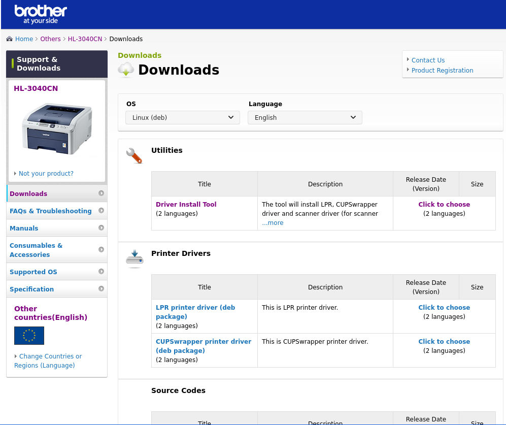

# hl-3040cn
Installing Brother HL-3040CN on Linux (pop!_os)

## Download Driver:

Download do **"Driver Install Tool"**:

[Download Driver from Brother site](https://support.brother.com/g/b/downloadlist.aspx?c=eu_ot&lang=en&prod=hl3040cn_all&os=128#SelectLanguageType-625_0_1)




## Instalar


``` bash
sudo su

gunzip linux-brprinter-installer-2.2.2-2.gz
bash linux-brprinter-installer-2.2.2-2 HL-3040CN

# DICA DOS PASSOS DA INSTALACAO:
# Will you specify the DeviceURI ?
#  - Se estiver conectada via cabo USB: N(no)
#  - Se conectada via Ethernet/Wireless: Y(yes)

```
